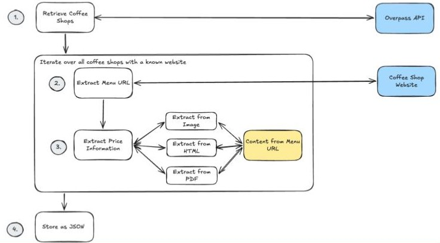

# Architecture Overview
<a id="coffeefinder-diagram"></a>


Our architecture for the CoffeeFinder project pipeline primarly consists of three substages as outlined in the [CoffeeFinder architecture diagram](#coffeefinder-diagram). Inititally, we retrieve our coffee shops from the overpass API. 
After the parsing the retrieved cofeeshops into a list of our internal **[Coffeeshop model](../../backend/models/coffee_shop.py)** holding all coffeshops of a certain city, we run an iteration on each of the coffeshops with provided website URL. Each iteration round of a fixed coffeeshop, can be divided into 2 subcomponents: webscraper and price extractor. 
The webscraper uses the given website URL of a coffeeshop to collect a set of possible menu URLs. The collection of potential menu URLs is then given to the price extractor which handles different file formats and tries to extract the `Cappucino` price. 

## Overpass API  
[get_coffee_shops_in_city()](../..//backend/scraper/overpassAPI.py:246) does load the initial data of each coffeeshop as a `GeoDataFrame` with OSM tags as columns and normalizes it to use the internal **Coffeeshop model** instead, directly enforcing a structured data format which persist during the entire pipeline execution. So after the first stage, we hold a list of **Coffeeshop Models** for each coffeeshop, which initialized the fields served by the overpassAPI and leaves the webscraper and price extractor fields undefined for later addition.

## Webscraper
Each coffeeshop that directly provides the menu URL from overpass API is directly forwarded to the price extraction. Otherwise, for each coffeeshop with a given website URL, the webscraper opens the website and searches for links that look like menu pages.  
For opening the pages we use [Playwright](https://playwright.dev/python/), which is a browser automation library. This allows the webscraper to load websites like a normal browser, so links that are created or changed by JavaScript will also be found.
It checks the visible link text and the link URL for words like menu, food, drinks, Speisekarte or Getränke. If no menu link is found on the first page, the webscraper follows internal links of the same website and repeats the search with a limited depth of up to 3 levels and a maximum of 20 page requests. Each page navigation also has a 15 second timeout, so slow or unresponsive pages are skipped instead of blocking the whole pipeline. These limits keep the crawl bounded and prevent the scraper from spending too much time on large or deeply nested websites. All possible menu URLs are collected as candidates and then tested one after another. During this testing, the current candidate is stored in the **Coffeeshop model** and forwarded to the extractor, which tries to read the menu content and extract the Cappuccino price.

## Price Extractor / Analyzer
The price extraction is called by the webscraper after a possible menu URL was found and stored as the current `menu_url` candidate in the **Coffeeshop model**. The webscraper requests this candidate URL, reads the returned `Content-Type`, and forwards the downloaded data to the [Analyzer](../../backend/analysis/analyzer.py), which selects the matching extraction strategy.  
Currently supported formats are image files, PDF documents, `text/html` pages and `application/xhtml+xml` pages, so menus can be processed when they are published as normal webpages, downloadable PDFs or images.  
For image menus we use [pytesseract](https://pypi.org/project/pytesseract/) as the OCR library, which reads the image with Pillow and converts the visible menu content into text using German and English language settings. For PDF menus we use `pdfplumber` to extract the page text directly, while HTML and XHTML menus are decoded as text and then handled by the same price parsing logic. After a text representation was created, the extractor searches the lines for the `Cappuccino` keyword and a nearby price pattern, also supporting the case where the name and price are split over following lines.  
If the extraction is succesful, the found menu item, price, currency and extraction timestamp are written into the **Coffeeshop model**, and the code flow is returning back to the coffeeshop iteration logic to continue with the next coffeshop.


## **Coffeeshop Model**
All information extracted during the pipeline execution of each stage enriches our internal **[Coffeeshop model](../../backend/models/coffee_shop.py)** in place. Keeping this **Coffeeshop model** as the central data state in our pipeline, allows us to enforce working on structured data during each step, allowing to keep the interfaces of each of the subcomponents well-defined, but independent of each other during development.

At the end of the pipeline, we result in a final list of all **Coffeeshop Models** of the queried city with the added, extracted information for each of the coffeeshops. 
Finally, the list of **Coffeeshop models** is converted into a JSON structure with `model_dump(mode="json")` and then written as JSON store of the queried city, allowing for a JSON-based frontend design. Because the **Coffeeshop model** is based on Pydantic, this conversion can also be done at any earlier point in the pipeline whenever an intermediate JSON representation is needed.

```jsonc
{
  "name": "Kulturcafé", // overpassAPI: parsed from OSM name
  "coordinates": [
    51.4458619, // overpassAPI: parsed from OSM geometry
    7.2595206 // overpassAPI: parsed from OSM geometry
  ],
  "category": "Cafe", // overpassAPI: hardcoded in Coffeeshop Model creation
  "website": {
    "url": "https://asta-bochum.de/kulturcafe/", // overpassAPI: parsed from OSM website
    "extracted_at": "2026-07-08T17:51:28.630072Z", // overpassAPI: set when website URL is present
    "last_checked": "2026-07-08T17:57:17.112385Z", // webscraper: set after website crawl
    "accessible": true // webscraper: set after website crawl
  },
  "menu": {
    "menu_url": "https://asta-bochum.de/kulturcafe-preise/", 
    // overpassAPI: initial candidate from website:menu
    // webscraper: otherwise candidate from discovered links
    // webscraper: overwritten for each tested candidate
    // final: first candidate with extracted items, else last tried
    "menu_url_last_checked": "2026-07-08T17:57:21.743621Z", 
    // webscraper: set after each candidate request
    // final: timestamp of final attempted candidate
    "menu_url_accessible": true, 
    // webscraper: set after each candidate request
    // final: status of final attempted candidate
    "currency": "EUR",  // extractor: defaults to EUR if items found
    "extracted_at": "2026-07-08T17:57:21.743608Z", // extractor: set when extraction succesful
    "items": [
      {
        "name": "Cappuccino", // extractor: parsed from successful candidate

        "price": 2.4 // extractor: parsed from successful candidate

      }
    ]
  }
},
``` 
*Example: **Coffeeshop model** for `Kulturcafé`. The code embedding further comments where each of the fields are set in our 3 staged pipeline to give you an understanding of the state under the hood.*
